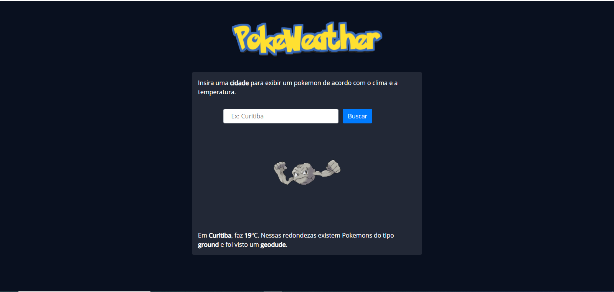
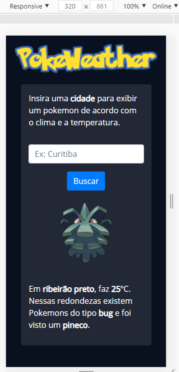

# Desafio Pokémon para Desenvolvedores

## Pré-requisitos
1. Ter o PHP instalado em sua máquina, recomendável usar a versão 7.4 ou superior.
2. Use o servidor de preferencia, como xampp, ou abra o index.php e digite o seguinte comando no terminal:

<code>php -S localhost:8000</code>

Agora basta abrir o servidor no seu navegador clicando com CTRL + Botão esquerdo do mouse.

## Como funciona?
Basta digitar uma cidade no campo de busca e será exibido um **Pokemon (foto e nome)** (de acordo com as regras do desafio), a **cidade** que foi digitada, a **temperatura** atual e se está **chovendo**.

## Prints do projeto:

## ✌️ Agradecimento
> - GrandeDev - 
> Me deu uma luz na hora de manipular as APIs
