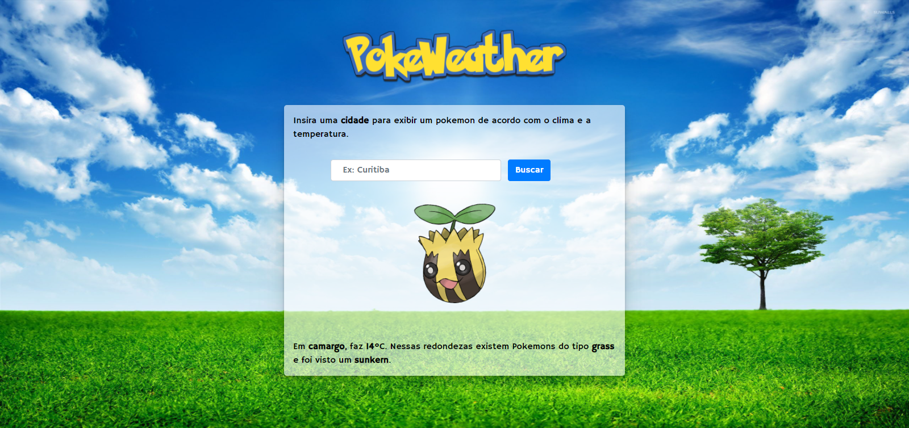
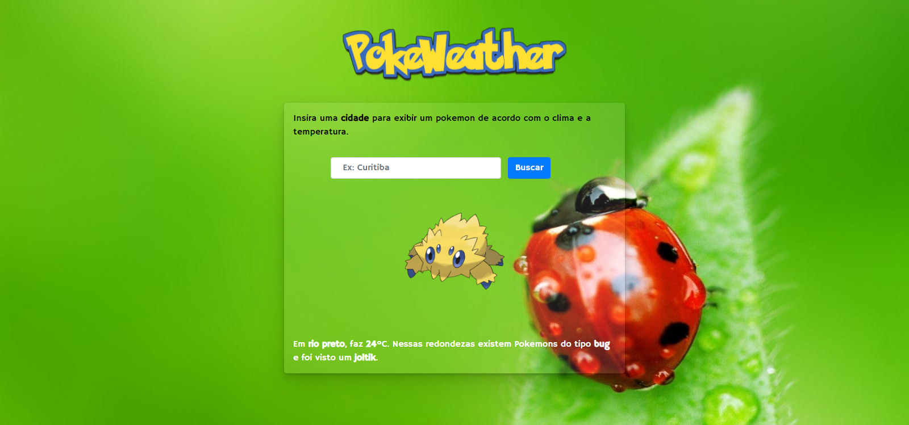
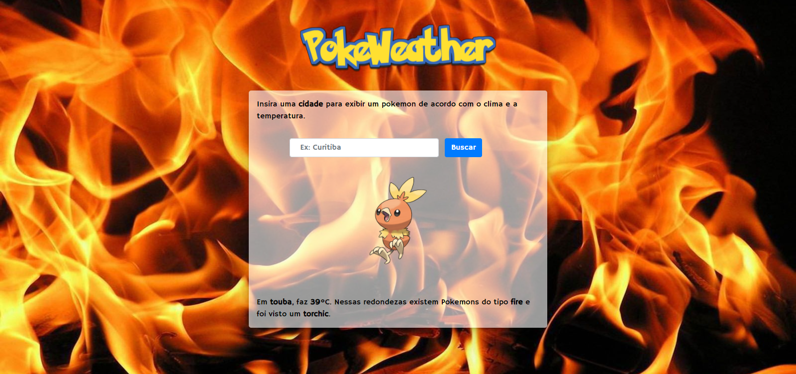
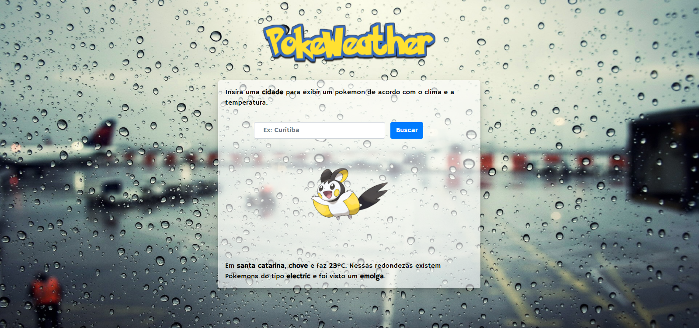
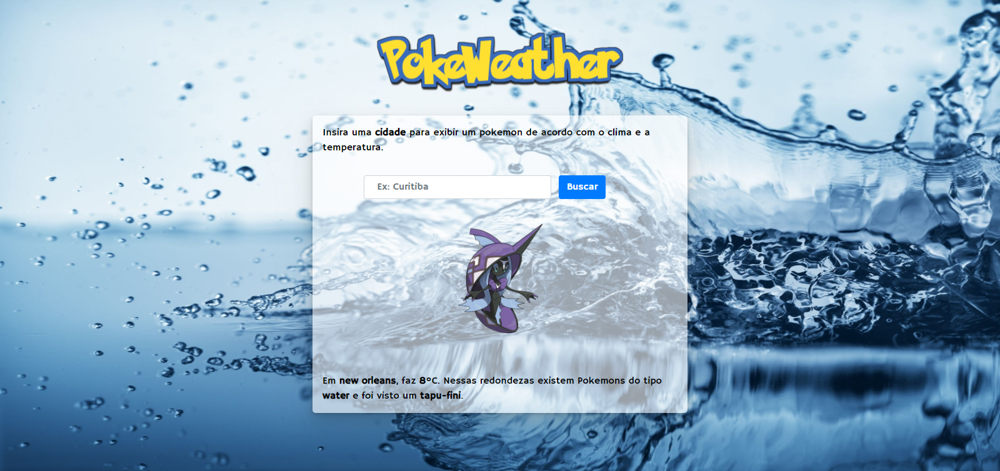
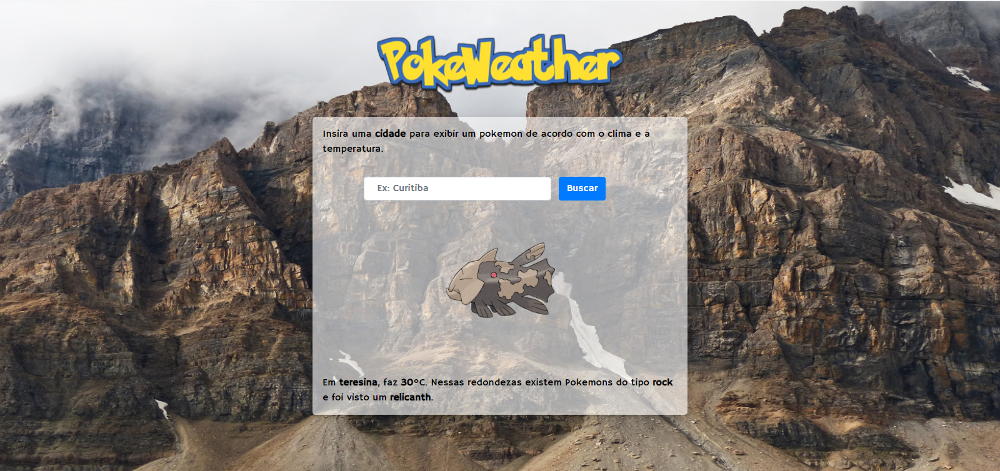
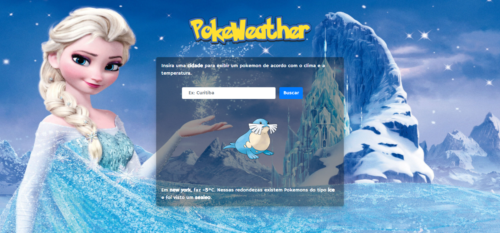

<h1 align="center">PokeWeather</h1>

## Pré-requisitos
1. Ter o PHP instalado em sua máquina, recomendável usar a versão 7.4 ou superior.
## 💻 Iniciando o servidor
2. 💡 Use o servidor de preferencia, como xampp, ou abra o index.php e digite o seguinte comando no terminal:

<code>php -S localhost:8000</code>

Agora basta abrir o servidor no seu navegador clicando com CTRL + Botão esquerdo do mouse no "http://localhost:8000".

<code>[Thu Feb 11 23:07:51 2021] PHP 7.4.3 Development Server (http://localhost:8000) started</code>

## Como funciona?
Basta digitar uma cidade no campo de busca e será exibido um **Pokemon (foto e nome)**,o **tipo** dele, a **cidade** que foi digitada, a **temperatura** atual, se está **chovendo** e o background irá mudar de acordo com o **tipo** do pokemon.

## Prints do projeto 
<h3>O Background muda de acordo com o tipo do pokemon</h3>
<h3>Tipo: Grass</h3>

<h3>Tipo: Bug</h3>

<h3>Tipo: Fire</h3>

<h3>Tipo: Ground</h3>

<h3>Tipo: Electric</h3>

<h3>Tipo: Water</h3>

<h3>Tipo: Rock</h3>

<h3>Tipo: Ice</h3>

## ✌️ Agradecimento
<pre> - GrandeDev - 
Me deu uma luz na hora de manipular as APIs
</pre>
